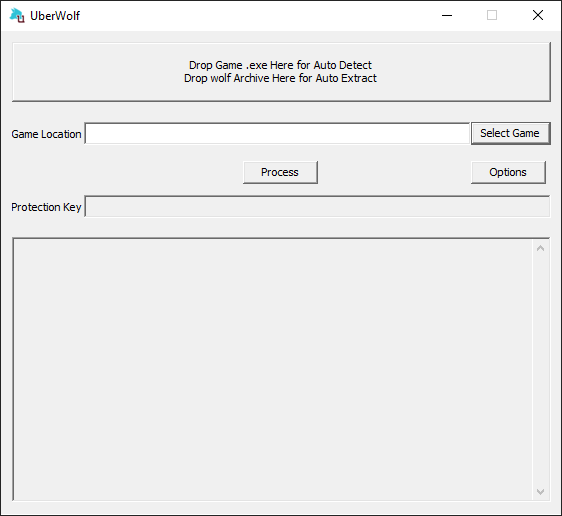

# UberWolf GUI
 Fully functional, GUI-based Wolf RPG decrypter with support for Wolf RPG Pro.

 

### Features

 - GUI application
 - Simple usage, based on drag and drop
 - Support for all possible file extensions
 - Automatic decryption key detection
 - Detection of the Pro Editor ***Protection Key*** if present

### Supported File Extensions
 - .wolf
 - .data
 - .pak
 - .bin
 - .assets
 - .content
 - .res
 - .resource

## Usage - Full Game Processing
- Drag and drop ***Game.exe*** or ***GamePro.exe*** onto the dedicated area or select it using the ***Select Game*** button.
- Press Process to unpack all archive files and, if present, detect the ***Protection Key***.

## Usage - Extract One or More Archives
 Drag and drop the archives onto the designated area and wait until the files are extracted.
 
 ## Localization

 Please look at the [Localization Guide](doc/localization.md) for information on translating the application into your language.

----

# UberWolfCli
 Simple command line interface to decrypt Wolf RPG games.

## Usage
 The usage of UberWolfCli is very similar to the GUI application:
 - Drag and drop ***Game.exe*** or ***GamePro.exe*** onto the executable to automatically detect the data folder and decrypt all files.
 - Drag and drop a ***folder*** folder onto the executable to extract all supported wolf files within it.
 - Drag and drop one or more supported files (e.g., ***.wolf***) onto the executable to extract them all.
 - Call it from the command line like this:
```bash
# Full auto-detect
UberWolfCli.exe "D:\Path to Game\Game.exe"
# Using a folder, e.g., Data
UberWolfCli.exe "D:\Path to Game\Data"
# Unpacking a single file
UberWolfCli.exe "D:\Path to Game\Data\BasicData.wolf"
```
